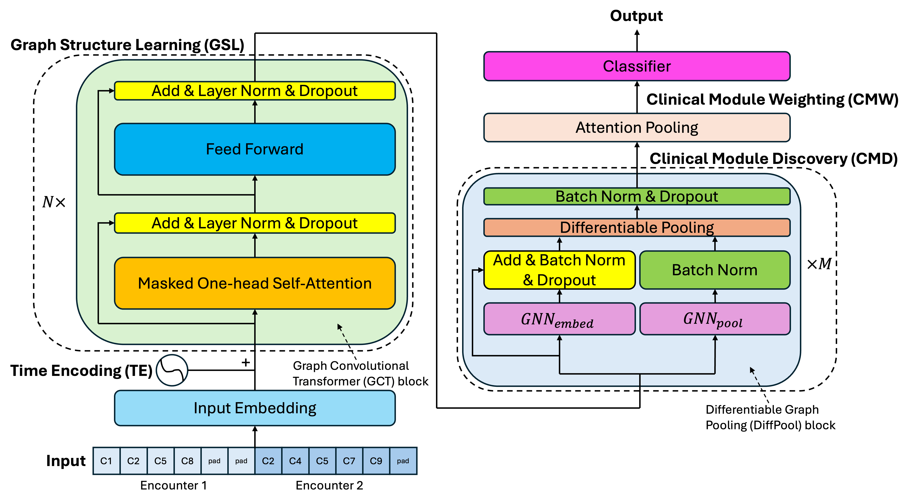

# Deep Patient Journey (DeePJ) 

DeePJ is a graph convolutional transformer and differentiable graph pooling-based model designed to uncover graph structures in EHR data. To replicate the experimental results on the eICU dataset from the paper, place the eICU data (https://physionet.org/content/eicu-crd/2.0/) in the eicu_full folder and run baselines.ipynb and model_interpretation.ipynb.

Acknowlegements:
1. The annotated transformer, Harvard NLP group, https://github.com/harvardnlp/annotated-transformer
2. GCT in PyTorch, https://github.com/dchang56/gct-pytorch
